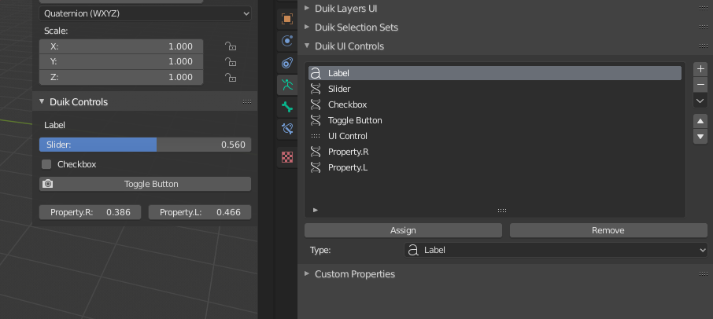
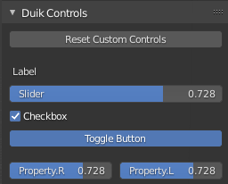
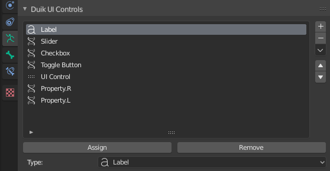

# UI Controls

With *Duik*, you can create nice UI controls for any (custom) property on the *Armature* or other objects you're working on.
This is a way to expose and group the controls needed by the animator using the rig in the `Item` tab of the *sidebar* of the *3D View* (with the transform properties), while keeping any other custom property hidden on bones not used as controllers. These controls have a better display than the native custom properties too.

[TOC]

## The UI

`3D View ‣ Sidebar ‣ Item Tab ‣ Duik Controls`

These *Duik Controls* are available in the *sidebar* of the *3D View*, in the `Item` tab.

Duik will try to build a nice layout, depending on the names of the controls, and their order in the list. Each time an *.R* suffix followed by an *.L* suffix is found, the two controls are showed in a row.

The *Reset Custom Controls* button will set back all custom properties to their default values. It is also available in the *3D view* context menu in pose mode and in `3D View ‣ Pose Menu ‣ Clear Transform`.

!!! warning
    For now, the *Reset Custom Controls* operator works only with custom properties and not native Blender properties.

!!! tip
    UI controls are a very nice way to expose (or not) the controls which may be useful for the animator, while keeping the other custom properties hidden.  
    Their UI is also nicer than the UI of the native custom properties.

!!! note
    Keep in mind that you can have the same UI Control on several bones at once, which is a nice way to be able to animate the same property from different places

## Create and manage controls

`Properties Panel ‣ Armature Data Tab ‣ Duik UI Controls`

In the `Armature data` tab of the `Properties` panel, you'll find the *Duik UI Contrlos* Panel.

Select a bone and click on the `+` button to create a UI Control.

You can also duplicate an existing control using the menu under the down arrow, which will automatically be updated depending on the bone currently selected, to quickly create another control for a property with the same name on another bone.

This control will be automatically added on the selected bone. You can add and remove any UI Control to any other bone using the `Assign` and `Remove` button.

### Configuration of the controls

There are three types of UI Controls:

- __*Label*__ is a simple text shown in the UI.
- __*Separator*__ is a blank space.
- __*Single Property*__ is an actual control.

#### Single property

When set on *Single Property*, the control has some options, which work the same way as in the *Edit driver* panel.

- *Prop:* is the object where to find the controlled property.
- *Path:* is the path copied when [right-click] on the property and choosing *copy data path*.
- *Toggle:* changes the appearance of boolean controls, to be either a button or a checkbox.
- *Slider:* changes the appearance of numerical controls, to be either a slider or a simple value.

*Last Modified on *