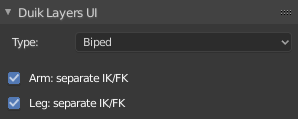
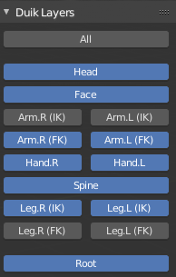
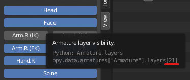

With *Duik*, you can easily create nice selectors for the bone layers on your armatures.

`Properties Panel ‣ Armature Data Tab ‣ Duik Layers UI`

In the `Armature data` tab of the `Properties` panel, you'll find the *Duik Layers UI* Panel.

`3D View ‣ Sidebar ‣ Tool Tab ‣ Duik Layers`

These controls change which layers are displayed in the `Tool` tab of the *sidebar* of the *3D View*.

At each button corresponds a bone layer on the Armature. Try the buttons to see at which layer they are attached. Their number is visible in the tooltip of the buttons too, if you have activated the option to see Python Tooltips in Blender.

Duik uses only the left part of the layers (from 1 to 7 and 16 to 23).

*Last Modified on *